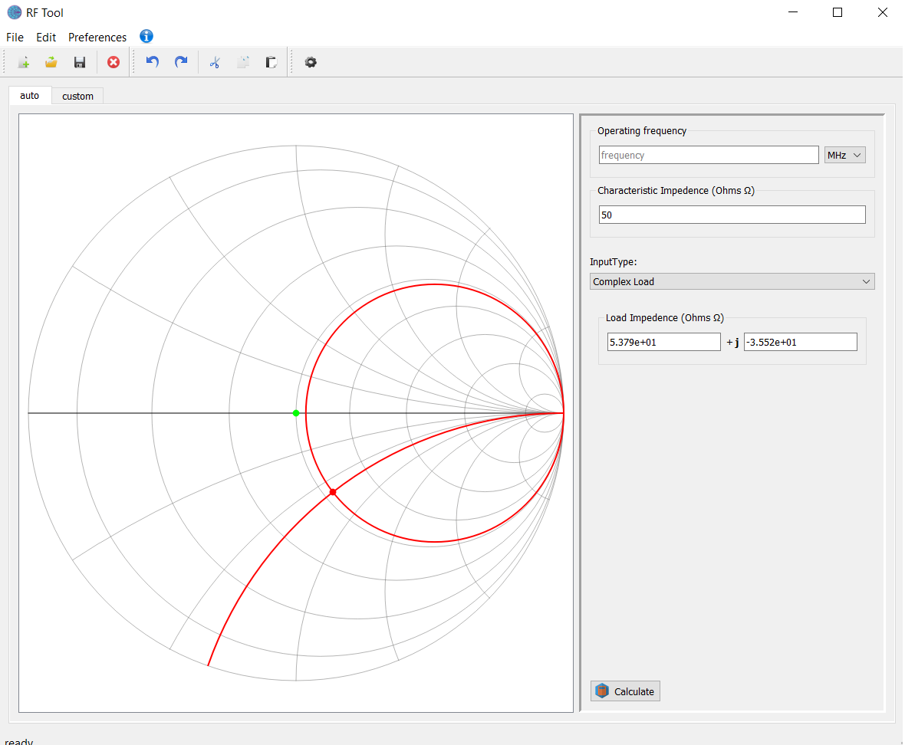
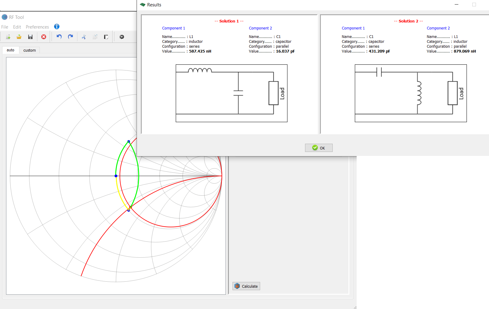
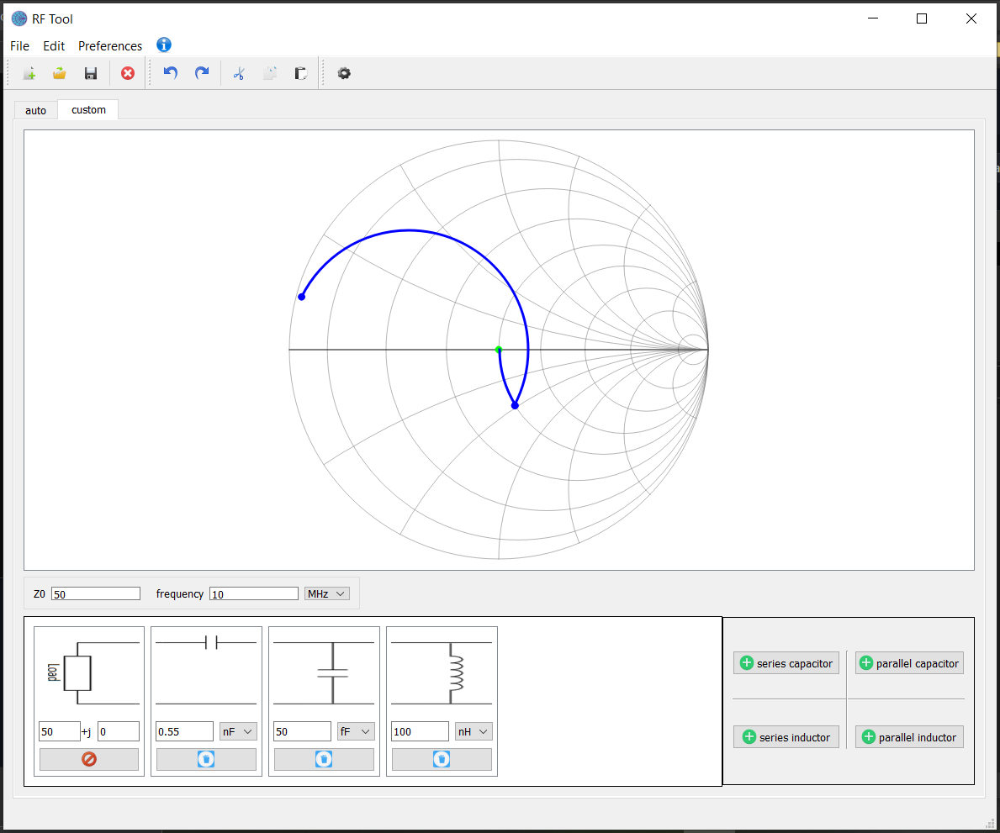

# RF-tool
A GUI tool developed using Python and PyQt5 to calculate and provide simple adapting circuits solutions for simple RF circuit adaptingto adapt RF systems.

#Feature:
- An inteactive smith chart
- Calculate, generate solutions based on the operating frequency, characteristic impedence and either the load impedence or the reflexion coefficient.
- A tool to design and experiment with custom solutions.

